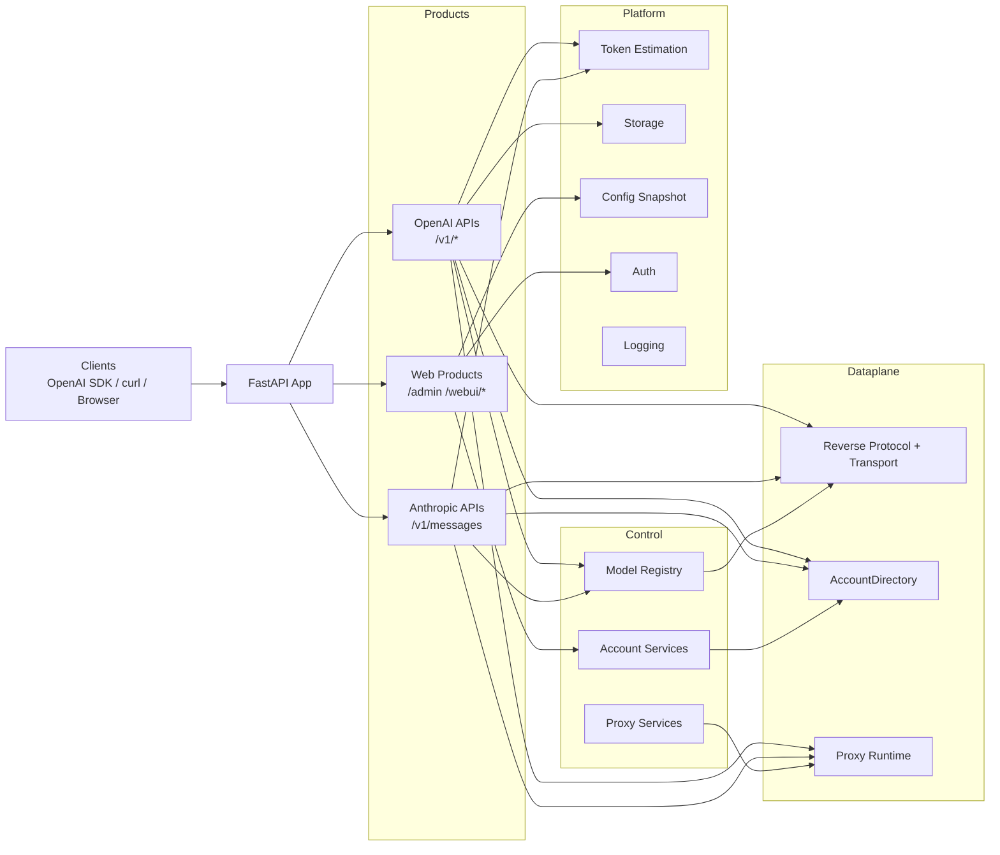

[](https://www.python.org/)
[](https://fastapi.tiangolo.com/)
[](../pyproject.toml)
[](../LICENSE)
[](../README.md)
[](https://deepwiki.com/chenyme/grok2api)
[](https://blog.cheny.me/blog/posts/grok2api)

> [!NOTE]
> This project is for learning and research only. Please comply with Grok's terms of use and all applicable local laws and regulations. Do not use it for illegal purposes. If you fork the project or open a PR, please keep the original author and frontend attribution.

<br>

Grok2API is a **FastAPI**-based Grok gateway that exposes Grok Web capabilities through OpenAI-compatible APIs. Core features:
- OpenAI-compatible endpoints: `/v1/models`, `/v1/chat/completions`, `/v1/responses`, `/v1/images/generations`, `/v1/images/edits`, `/v1/videos`, `/v1/videos/{video_id}`, `/v1/videos/{video_id}/content`
- Anthropic-compatible endpoint: `/v1/messages`
- Streaming and non-streaming chat, explicit reasoning output, function-tool structure passthrough, and unified token / usage accounting
- Multi-account pools, tier-aware selection, failure feedback, quota synchronization, and automatic maintenance
- Local image/video caching and locally proxied media URLs
- Text-to-image, image editing, text-to-video, and image-to-video support
- Built-in Admin dashboard, Web Chat, Masonry image generation, and ChatKit voice page

<br>

## Service Architecture



<br>

## Quick Start

### Local Deployment

```bash
git clone https://github.com/chenyme/grok2api
cd grok2api
cp .env.example .env
uv sync
uv run granian --interface asgi --host 0.0.0.0 --port 8000 --workers 1 app.main:app
```

### Docker Compose

```bash
git clone https://github.com/chenyme/grok2api
cd grok2api
cp .env.example .env
docker compose up -d
```

### Vercel

[](https://vercel.com/new/clone?repository-url=https://github.com/chenyme/grok2api&env=LOG_LEVEL,LOG_FILE_ENABLED,DATA_DIR,LOG_DIR,ACCOUNT_STORAGE,ACCOUNT_REDIS_URL,ACCOUNT_MYSQL_URL,ACCOUNT_POSTGRESQL_URL)

### Render

[](https://render.com/deploy?repo=https://github.com/chenyme/grok2api)

### First Launch

1. Change `app.app_key`
2. Set `app.api_key`
3. Set `app.app_url` otherwise image and video URLs may return `403 Forbidden`

<br>

## WebUI

### Routes

| Page | Path |
| :-- | :-- |
| Admin login | `/admin/login` |
| Account management | `/admin/account` |
| Config management | `/admin/config` |
| Cache management | `/admin/cache` |
| WebUI login | `/webui/login` |
| Web Chat | `/webui/chat` |
| Masonry | `/webui/masonry` |
| ChatKit | `/webui/chatkit` |

### Authentication Rules

| Scope | Config | Rule |
| :-- | :-- | :-- |
| `/v1/*` | `app.api_key` | No extra authentication when empty |
| `/admin/*` | `app.app_key` | Default value: `grok2api` |
| `/webui/*` | `app.webui_enabled`, `app.webui_key` | Disabled by default; if `webui_key` is empty, no extra verification is required |

<br>

## Configuration

### Configuration Layers

| Location | Purpose | Effective Time |
| :-- | :-- | :-- |
| `.env` | Pre-start configuration | At service startup |
| `${DATA_DIR}/config.toml` | Runtime configuration | Effective immediately after save |
| `config.defaults.toml` | Default template | On first initialization |


### Environment Variables

| Variable | Description | Default |
| :-- | :-- | :-- |
| `TZ` | Time zone | `Asia/Shanghai` |
| `LOG_LEVEL` | Log level | `INFO` |
| `LOG_FILE_ENABLED` | Write local log files | `true` |
| `ACCOUNT_SYNC_INTERVAL` | Account directory incremental sync interval in seconds | `30` |
| `ACCOUNT_SYNC_ACTIVE_INTERVAL` | Active sync interval after account-directory changes are detected, in seconds | `3` |
| `SERVER_HOST` | Service bind address | `0.0.0.0` |
| `SERVER_PORT` | Service port | `8000` |
| `SERVER_WORKERS` | Granian worker count | `1` |
| `HOST_PORT` | Docker Compose published host port | `8000` |
| `DATA_DIR` | Local data root for accounts, locally cached media files, and cache indexes | `./data` |
| `LOG_DIR` | Local log directory | `./logs` |
| `ACCOUNT_STORAGE` | Account storage backend | `local` |
| `ACCOUNT_LOCAL_PATH` | SQLite path for `local` account storage | `${DATA_DIR}/accounts.db` |
| `ACCOUNT_REDIS_URL` | Redis DSN for `redis` mode | `""` |
| `ACCOUNT_MYSQL_URL` | SQLAlchemy DSN for `mysql` mode | `""` |
| `ACCOUNT_POSTGRESQL_URL` | SQLAlchemy DSN for `postgresql` mode | `""` |
| `ACCOUNT_SQL_POOL_SIZE` | Core connection pool size for SQL backends | `5` |
| `ACCOUNT_SQL_MAX_OVERFLOW` | Maximum overflow connections above pool size | `10` |
| `ACCOUNT_SQL_POOL_TIMEOUT` | Seconds to wait for a free connection from the pool | `30` |
| `ACCOUNT_SQL_POOL_RECYCLE` | Max connection lifetime in seconds before reconnect | `1800` |
| `CONFIG_LOCAL_PATH` | Runtime config file path for `local` config storage | `${DATA_DIR}/config.toml` |

Runtime config can also be overridden with `GROK_`-prefixed environment variables. For example, `GROK_APP_API_KEY` overrides `app.api_key`, and `GROK_FEATURES_STREAM` overrides `features.stream`.

### System Configuration Groups

| Group | Key Items |
| :-- | :-- |
| `app` | `app_key`, `app_url`, `api_key`, `webui_enabled`, `webui_key` |
| `logging` | `file_level`, `max_files` |
| `features` | `temporary`, `memory`, `stream`, `thinking`, `auto_chat_mode_fallback`, `thinking_summary`, `dynamic_statsig`, `enable_nsfw`, `show_search_sources`, `custom_instruction`, `image_format`, `video_format` |
| `proxy.egress` | `mode`, `proxy_url`, `proxy_pool`, `resource_proxy_url`, `resource_proxy_pool`, `skip_ssl_verify` |
| `proxy.clearance` | `mode`, `cf_cookies`, `user_agent`, `browser`, `flaresolverr_url`, `timeout_sec`, `refresh_interval` |
| `retry` | `reset_session_status_codes`, `max_retries`, `on_codes` |
| `account.refresh` | `basic_interval_sec`, `super_interval_sec`, `heavy_interval_sec`, `usage_concurrency`, `on_demand_min_interval_sec` |
| `cache.local` | `image_max_mb`, `video_max_mb` |
| `chat` | `timeout` |
| `image` | `timeout`, `stream_timeout` |
| `video` | `timeout` |
| `voice` | `timeout` |
| `asset` | `upload_timeout`, `download_timeout`, `list_timeout`, `delete_timeout` |
| `nsfw` | `timeout` |
| `batch` | `nsfw_concurrency`, `refresh_concurrency`, `asset_upload_concurrency`, `asset_list_concurrency`, `asset_delete_concurrency` |

### Image and Video Formats

| Config | Allowed Values |
| :-- | :-- |
| `features.image_format` | `grok_url`, `local_url`, `grok_md`, `local_md`, `base64` |
| `features.video_format` | `grok_url`, `local_url`, `grok_html`, `local_html` |

<br>

## Supported Models
> You can use `GET /v1/models` to retrieve the currently supported model list.

### Chat

| Model | mode | tier |
| :-- | :-- | :-- |
| `grok-4.20-0309-non-reasoning` | `fast` | `basic` |
| `grok-4.20-0309` | `auto` | `basic` |
| `grok-4.20-0309-reasoning` | `expert` | `basic` |
| `grok-4.20-0309-non-reasoning-super` | `fast` | `super` |
| `grok-4.20-0309-super` | `auto` | `super` |
| `grok-4.20-0309-reasoning-super` | `expert` | `super` |
| `grok-4.20-0309-non-reasoning-heavy` | `fast` | `heavy` |
| `grok-4.20-0309-heavy` | `auto` | `heavy` |
| `grok-4.20-0309-reasoning-heavy` | `expert` | `heavy` |
| `grok-4.20-multi-agent-0309` | `heavy` | `heavy` |
| `grok-4.20-fast` | `fast` | `basic`, prefers higher-tier pools |
| `grok-4.20-auto` | `auto` | `basic`, prefers higher-tier pools |
| `grok-4.20-expert` | `expert` | `basic`, prefers higher-tier pools |
| `grok-4.20-heavy` | `heavy` | `heavy` |
| `grok-4.3-beta` | `grok-420-computer-use-sa` | `super` |

### Image

| Model | mode | tier |
| :-- | :-- | :-- |
| `grok-imagine-image-lite` | `fast` | `basic` |
| `grok-imagine-image` | `auto` | `super` |
| `grok-imagine-image-pro` | `auto` | `super` |

### Image Edit

| Model | mode | tier |
| :-- | :-- | :-- |
| `grok-imagine-image-edit` | `auto` | `super` |

### Video

| Model | mode | tier |
| :-- | :-- | :-- |
| `grok-imagine-video` | `auto` | `super` |

<br>

## API Overview

| Endpoint | Auth Required | Description |
| :-- | :-- | :-- |
| `GET /v1/models` | Yes | List currently enabled models |
| `GET /v1/models/{model_id}` | Yes | Retrieve one model |
| `POST /v1/chat/completions` | Yes | Unified entry point for chat, image, and video |
| `POST /v1/responses` | Yes | OpenAI Responses API compatible subset |
| `POST /v1/messages` | Yes | Anthropic Messages API compatible endpoint |
| `POST /v1/images/generations` | Yes | Standalone image generation endpoint |
| `POST /v1/images/edits` | Yes | Standalone image editing endpoint |
| `POST /v1/videos` | Yes | Asynchronous video job creation |
| `GET /v1/videos/{video_id}` | Yes | Retrieve a video job |
| `GET /v1/videos/{video_id}/content` | Yes | Fetch the final video file |
| `GET /v1/files/video?id=...` | No | Fetch a locally cached video |
| `GET /v1/files/image?id=...` | No | Fetch a locally cached image |

<br>

## API Examples

> The examples below use `http://localhost:8000`.

<details>
<summary><code>GET /v1/models</code></summary>
<br>

```bash
curl http://localhost:8000/v1/models \
  -H "Authorization: Bearer $GROK2API_API_KEY"
```

<details>
<summary>Field Notes</summary>
<br>

| Field | Location | Description |
| :-- | :-- | :-- |
| `Authorization` | Header | Required when `app.api_key` is non-empty. Use `Bearer <api_key>` |

<br>
</details>

<br>
</details>

<details>
<summary><code>POST /v1/chat/completions</code></summary>
<br>

Chat:

```bash
curl http://localhost:8000/v1/chat/completions \
  -H "Content-Type: application/json" \
  -H "Authorization: Bearer $GROK2API_API_KEY" \
  -d '{
    "model": "grok-4.20-auto",
    "stream": true,
    "reasoning_effort": "high",
    "messages": [
      {"role":"user","content":"Hello"}
    ]
  }'
```

Image:

```bash
curl http://localhost:8000/v1/chat/completions \
  -H "Content-Type: application/json" \
  -H "Authorization: Bearer $GROK2API_API_KEY" \
  -d '{
    "model": "grok-imagine-image",
    "stream": true,
    "messages": [
      {"role":"user","content":"A cat floating in space"}
    ],
    "image_config": {
      "n": 2,
      "size": "1024x1024",
      "response_format": "url"
    }
  }'
```

Video:

```bash
curl http://localhost:8000/v1/chat/completions \
  -H "Content-Type: application/json" \
  -H "Authorization: Bearer $GROK2API_API_KEY" \
  -d '{
    "model": "grok-imagine-video",
    "stream": true,
    "messages": [
      {"role":"user","content":"A neon rainy street at night, cinematic slow tracking shot"}
    ],
    "video_config": {
      "seconds": 10,
      "size": "1792x1024",
      "resolution_name": "720p",
      "preset": "normal"
    }
  }'
```

<details>
<summary>Field Notes</summary>
<br>

| Field | Description |
| :-- | :-- |
| `messages` | Supports text and multimodal content blocks |
| `stream` | Whether to stream output; falls back to `features.stream` when omitted |
| `reasoning_effort` | `none`, `minimal`, `low`, `medium`, `high`, `xhigh`; `none` disables reasoning output |
| `temperature` / `top_p` | Sampling parameters, default `0.8` / `0.95` |
| `tools` | OpenAI function tools structure |
| `tool_choice` | `auto`, `required`, or a specific function tool |
| `image_config` | Image model parameters |
| \|_ `n` | `1-4` for `lite`, `1-10` for other image models, `1-2` for edit |
| \|_ `size` | `1280x720`, `720x1280`, `1792x1024`, `1024x1792`, `1024x1024` |
| \|_ `response_format` | `url`, `b64_json` |
| `video_config` | Video model parameters |
| \|_ `seconds` | `6`, `10`, `12`, `16`, `20` |
| \|_ `size` | `720x1280`, `1280x720`, `1024x1024`, `1024x1792`, `1792x1024` |
| \|_ `resolution_name` | `480p`, `720p` |
| \|_ `preset` | `fun`, `normal`, `spicy`, `custom` |

<br>
</details>

<br>
</details>

<details>
<summary><code>POST /v1/responses</code></summary>
<br>

```bash
curl http://localhost:8000/v1/responses \
  -H "Content-Type: application/json" \
  -H "Authorization: Bearer $GROK2API_API_KEY" \
  -d '{
    "model": "grok-4.20-auto",
    "input": "Explain quantum tunneling",
    "instructions": "Keep the answer concise.",
    "stream": true,
    "reasoning": {
      "effort": "high"
    }
  }'
```

<details>
<summary>Field Notes</summary>
<br>

| Field | Description |
| :-- | :-- |
| `model` | Model ID. It must be an enabled model |
| `input` | User input; supports a string or a Responses API-style message array |
| `instructions` | Optional system instructions injected as a system message |
| `stream` | Whether to stream output; falls back to `features.stream` when omitted |
| `reasoning` | Optional reasoning configuration |
| \|_ `effort` | `none` disables reasoning output; other values enable it |
| `temperature` / `top_p` | Sampling parameters, default `0.8` / `0.95` |
| `tools` / `tool_choice` | Function tools are supported; flat Responses API tool definitions are normalized automatically |

<br>
</details>

<br>
</details>

<details>
<summary><code>POST /v1/messages</code></summary>
<br>

```bash
curl http://localhost:8000/v1/messages \
  -H "Content-Type: application/json" \
  -H "Authorization: Bearer $GROK2API_API_KEY" \
  -d '{
    "model": "grok-4.20-auto",
    "stream": true,
    "thinking": {
      "type": "enabled",
      "budget_tokens": 1024
    },
    "messages": [
      {
        "role": "user",
        "content": "Explain quantum tunneling in three sentences"
      }
    ]
  }'
```

<details>
<summary>Field Notes</summary>
<br>

| Field | Description |
| :-- | :-- |
| `model` | Model ID. It must be an enabled model |
| `messages` | Anthropic Messages-format messages; supports text, image, document, and tool-result blocks |
| `system` | Optional system prompt; accepts a string or an array of text blocks |
| `stream` | Whether to stream output; falls back to `features.stream` when omitted |
| `thinking` | Optional reasoning configuration |
| \|_ `type` | `disabled` disables reasoning output; other configs enable it |
| `max_tokens` | Accepted but currently ignored because Grok upstream does not expose this parameter |
| `tools` / `tool_choice` | Anthropic tool definitions are supported and converted to internal function tools |

<br>
</details>

<br>
</details>

<details>
<summary><code>POST /v1/images/generations</code></summary>
<br>

```bash
curl http://localhost:8000/v1/images/generations \
  -H "Content-Type: application/json" \
  -H "Authorization: Bearer $GROK2API_API_KEY" \
  -d '{
    "model": "grok-imagine-image",
    "prompt": "A cat floating in space",
    "n": 1,
    "size": "1792x1024",
    "response_format": "url"
  }'
```

<details>
<summary>Field Notes</summary>
<br>

| Field | Description |
| :-- | :-- |
| `model` | Image model: `grok-imagine-image-lite`, `grok-imagine-image`, or `grok-imagine-image-pro` |
| `prompt` | Image generation prompt |
| `n` | Number of images; `1-4` for `lite`, `1-10` for other image models |
| `size` | Supports `1280x720`, `720x1280`, `1792x1024`, `1024x1792`, `1024x1024` |
| `response_format` | `url` or `b64_json` |

<br>
</details>

<br>
</details>

<details>
<summary><code>POST /v1/images/edits</code></summary>
<br>

```bash
curl http://localhost:8000/v1/images/edits \
  -H "Authorization: Bearer $GROK2API_API_KEY" \
  -F "model=grok-imagine-image-edit" \
  -F "prompt=Make this image sharper" \
  -F "image[]=@/path/to/image.png" \
  -F "n=1" \
  -F "size=1024x1024" \
  -F "response_format=url"
```

<details>
<summary>Field Notes</summary>
<br>

| Field | Description |
| :-- | :-- |
| `model` | Image-edit model, currently `grok-imagine-image-edit` |
| `prompt` | Edit instruction |
| `image[]` | Reference image multipart file field; up to 5 images are used |
| `n` | Number of outputs, range `1-2` |
| `size` | Currently only `1024x1024` is supported |
| `response_format` | `url` or `b64_json` |
| `mask` | Not supported yet; passing it returns a validation error |

<br>
</details>

<br>
</details>

<details>
<summary><code>POST /v1/videos</code></summary>
<br>

```bash
curl http://localhost:8000/v1/videos \
  -H "Authorization: Bearer $GROK2API_API_KEY" \
  -F "model=grok-imagine-video" \
  -F "prompt=A neon rainy street at night, cinematic slow tracking shot" \
  -F "seconds=10" \
  -F "size=1792x1024" \
  -F "resolution_name=720p" \
  -F "preset=normal" \
  -F "input_reference[]=@/path/to/reference.png"
```

```bash
curl http://localhost:8000/v1/videos/<video_id> \
  -H "Authorization: Bearer $GROK2API_API_KEY"

curl -L http://localhost:8000/v1/videos/<video_id>/content \
  -H "Authorization: Bearer $GROK2API_API_KEY" \
  -o result.mp4
```

<details>
<summary>Field Notes</summary>
<br>

| Field | Description |
| :-- | :-- |
| `model` | Video model, currently `grok-imagine-video` |
| `prompt` | Video generation prompt |
| `seconds` | Video length: `6`, `10`, `12`, `16`, `20` |
| `size` | Supports `720x1280`, `1280x720`, `1024x1024`, `1024x1792`, `1792x1024` |
| `resolution_name` | `480p` or `720p` |
| `preset` | `fun`, `normal`, `spicy`, `custom` |
| `input_reference[]` | Optional image-to-video reference multipart file field; at most the first 5 images are used |
| `video_id` | Video job ID returned by `POST /v1/videos`; used to retrieve the job or download the final video |

<br>
</details>

<br>
</details>

<br>

## Star History

[](https://star-history.com/#Chenyme/grok2api&Timeline)
